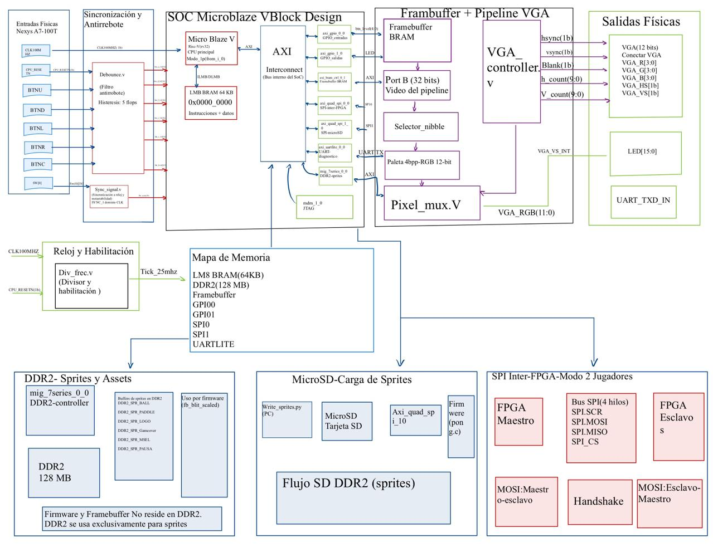

# Pong Multijugador — Nexys A7-100T

Sistema embebido de Pong sobre FPGA con MicroBlaze RISC-V. Soporta modo 1 jugador (con IA) y modo 2 jugadores en pantallas independientes conectadas vía SPI.

**Curso:** EL3313 Taller de Diseño Digital, I Semestre 2026  
**Placa:** Digilent Nexys A7-100T (Artix-7 XC7A100T)  
**Herramientas:** Vivado 2024.1 / Vitis 2024.1

---

## Video explicativo del proyecto

Demostración y explicación del funcionamiento del sistema: https://youtu.be/P1XJVjYdZMU

---

## Tabla de contenidos

[Video explicativo del proyecto](#video-explicativo-del-proyecto)

1. [Descripción del proyecto](#1-descripción-del-proyecto)
2. [Requisitos](#2-requisitos)
3. [Arquitectura del sistema](#3-arquitectura-del-sistema)
4. [Estructura del repositorio](#4-estructura-del-repositorio)
5. [Archivos clave](#5-archivos-clave)
6. [Clonar el repositorio](#6-clonar-el-repositorio)
7. [Qué es HoG y por qué lo usamos](#7-qué-es-hog-y-por-qué-lo-usamos)
8. [Paso 1 — Generar el bitstream con Vivado](#8-paso-1---generar-el-bitstream-con-vivado)
9. [Paso 2 — Compilar el firmware con Vitis](#9-paso-2---compilar-el-firmware-con-vitis)
10. [Paso 3 — Preparar la microSD](#10-paso-3---preparar-la-microsd)
11. [Paso 4 — Programar la FPGA](#11-paso-4---programar-la-fpga)
12. [Cómo jugar](#12-cómo-jugar)
13. [Modo 2 jugadores — conexión entre FPGAs](#13-modo-2-jugadores---conexión-entre-fpgas)
14. [Mapeo de pines y periféricos](#14-mapeo-de-pines-y-periféricos)
15. [Resultados de síntesis](#15-resultados-de-síntesis)
16. [Cumplimiento de requerimientos del proyecto](#16-cumplimiento-de-requerimientos-del-proyecto)
17. [Estado funcional del proyecto](#17-estado-funcional-del-proyecto)
18. [Notas técnicas importantes](#18-notas-técnicas-importantes)
19. [Errores comunes y soluciones](#19-errores-comunes-y-soluciones)
20. [Problemas presentados en el desarrollo del proyecto](#20-problemas-presentado-en-el-desarrollo-del-proyecto)
21. [Buenas prácticas aplicadas](#21-buenas-prácticas-aplicadas)
22. [Repositorio público](#22-repositorio-público)
23. [Nota de uso de Inteligencia Artificial](#nota-de-uso-de-inteligencia-artificial)

---

## 1. Descripción del proyecto

El sistema implementa el juego Pong clásico con las siguientes características:

- **Modo 1 jugador**: el jugador controla la paleta derecha con `BTNU`/`BTND`; la IA
  controla la paleta izquierda con velocidad variable y reacción con retraso aleatorio.
- **Modo 2 jugadores**: cada FPGA renderiza un campo de 640×480 del tablero virtual de
  1280×480. El Maestro (`SW[0]=0`) controla la física y envía estado completo (posición
  de pelota, paletas, marcador y estado de juego) vía SPI al Esclavo (`SW[0]=1`), que
  responde con la posición de su paleta local.
- **Video**: salida VGA 640×480 @ 60 Hz, 16 colores con paleta de índice de 4 bits
  codificada en hardware.
- **Sprites**: el firmware pre-carga sprites sólidos por defecto en DDR2 al arrancar
  (`ddr2_sprite_defaults`). Si la microSD inicializa correctamente, los sprites BMP
  preparados con `write_sprites.py` se cargan sobre esos valores.
- **Puntuación**: el primero en alcanzar 10 puntos gana. El marcador se muestra en
  pantalla y en los LEDs de la placa.

El selector de modo es `SW[0]` (pin J15): en `0` el firmware actúa como Maestro o en
modo 1P; en `1` actúa como Esclavo en una partida 2P.

---

## 2. Requisitos

### Hardware

- 1 o 2 placas **Nexys A7-100T**
- Cable micro-USB para programación JTAG (viene con la placa)
- Tarjeta **microSD** (cualquier capacidad; clase 4 o superior)
- Lector de tarjetas microSD o adaptador USB para la PC
- Monitor con entrada **VGA** y cable VGA
- Para modo 2 jugadores: 5 cables hembra-hembra para conectar los PMOD JA (SCK, MOSI, MISO, CS, GND)

### Software

| Herramienta | Versión | Uso |
|---|---|---|
| Vivado | 2024.1 | Síntesis, implementación y bitstream |
| Vitis | 2024.1 | Compilar el firmware en C |
| Python 3 | 3.8+ | Escribir sprites en la microSD |
| Pillow (pip) | cualquiera | Procesamiento de imágenes en write_sprites.py |
| Git | cualquiera | Clonar el repositorio y gestionar HoG |

Instalar Pillow si no está disponible:

```bash
pip install Pillow
```

---

## 3. Arquitectura del sistema

### Diagrama de bloques



### Visión general

```text
microSD (SPI1) MicroBlaze V (rv32i)
                  LMB BRAM 64 KB (código + datos)
                        |
          +-------------+------------------+------------------+
          |             |                  |                  |
         AXI           AXI               AXI               AXI
          |             |                  |                  |
    BRAM framebuffer  DDR2 128 MB       GPIO0             SPI0
    Port A (escrit.)  (sprites/assets)  (botones/SW/vsync) (inter-FPGA 2P)
          |
    Port B (lect.)
          |
    Controlador VGA al monitor
    640x480 @ 60 Hz
```

### Procesador

El núcleo de procesamiento es un **MicroBlaze V** configurado como procesador RISC-V rv32i
dentro del Block Design de Vivado (`BD/microblaze_v.bd`). Ejecuta firmware bare-metal en C
(`src/sw/pong.c`) cargado desde el host por JTAG. No utiliza sistema operativo.

**Justificación**: MicroBlaze V es el procesador soft-core disponible en el ecosistema
Vivado/Vitis para Artix-7. Al ser rv32i, es compatible con la cadena de herramientas
RISC-V estándar y elimina la dependencia de toolchains propietarios. Su integración
nativa con AXI4 simplifica la conexión de periféricos (GPIO, SPI, UART, MIG DDR2)
sin necesidad de bridges adicionales.

### Justificación del firmware bare-metal

El proyecto utiliza firmware bare-metal en lugar de un sistema operativo por las
siguientes razones técnicas:

- **Menor sobrecarga**: sin capa de OS, el firmware accede directamente a los registros
  de los periféricos AXI mediante `XGpio`, `XSpi`, `Xil_Out32` e `Xil_In32` sin
  overhead de planificación ni gestión de procesos.
- **Control determinístico del ciclo principal**: el loop de juego sincroniza el
  renderizado con el vsync leyendo el bit 5 de GPIO0 directamente, garantizando una
  cadencia de frame predecible.
- **Acceso directo al framebuffer**: el firmware escribe píxeles a `FB_BASE`
  (`XPAR_AXI_BRAM_CTRL_0_BASEADDR`) mediante `Xil_Out32` sin intermediarios,
  maximizando la tasa de actualización de pantalla.
- **Suficiente para la aplicación**: un juego embebido con física simple, lectura de
  botones, renderizado VGA y SPI es inherentemente secuencial y no requiere los
  servicios de un RTOS.
- **Integración directa con drivers Xilinx**: `pong.c` usa la BSP `standalone`
  generada por Vitis, con `XGpio`, `XSpi` y `xil_printf` integrados directamente.

### Subsistema de video (framebuffer)

**Justificación del framebuffer en BRAM**: usar BRAM como framebuffer desacopla el
procesador (que escribe en cualquier orden y momento) del controlador VGA (que necesita
leer píxeles en orden estricto a 25 MHz). Esto permite al CPU actualizar regiones
arbitrarias de la pantalla sin impactar el timing VGA.

El framebuffer está almacenado en una BRAM True Dual Port instanciada en el Block Design:

| Parámetro | Valor |
| --- | --- |
| Resolución | 640 × 480 píxeles |
| Profundidad de color | 4 bits por píxel (índice de paleta) |
| Tamaño total | 38 400 palabras de 32 bits |
| Empaquetado | Big-endian: `word[31:28]` = píxel 0 … `word[3:0]` = píxel 7 |
| Puerto A | 32 bits, AXI — escritura por el firmware |
| Puerto B | 32 bits, nativo a 100 MHz — lectura por el controlador VGA |

Cálculo de dirección para un píxel en coordenadas `(x, y)`:

```text
pixel_idx = y * 640 + x
word_addr = pixel_idx >> 3
nibble    = pixel_idx[2:0]   (selecciona uno de los 8 nibbles en la palabra)
```

### Pipeline VGA

**Justificación**: el controlador VGA genera señales de sincronismo y coordenadas de
pixel a 25 MHz a partir del reloj de 100 MHz, usando un divisor parametrizable
(`div_frec`, `DIVISOR=4`) para evitar crear un dominio de reloj adicional y simplificar
el análisis de timing.

```text
Ciclo N  : addr = f(h_count, v_count) a BRAM inicia lectura
Ciclo N+1: dout disponible a se registra junto con nibble_sel, blank, hsync, vsync
Ciclo N+1: paleta convierte el nibble a RGB 12-bit a pixel_mux fuerza RGB=0 en blanking
```

### Paleta de colores

La paleta está codificada directamente en `top_pong_project.v` (línea 274) y debe
coincidir con las macros del firmware en `pong.c` (línea 53).
Convierte el índice de 4 bits a RGB de 12 bits `{R[3:0], G[3:0], B[3:0]}`:

| Índice | Color | RGB | Uso en el juego |
| --- | --- | --- | --- |
| `0x0` | Negro | `000` | Fondo |
| `0x1` | Blanco | `FFF` | Pelota y paletas |
| `0x2` | Rojo | `F00` | Puntuación J2 / derrota |
| `0x3` | Azul | `00F` | Puntuación J1 |
| `0x4` | Amarillo | `FF0` | Cursor de menú |
| `0x5` | Verde | `0F0` | Victoria |
| `0x6` | Naranja | `F80` | — |
| `0x7` | Gris medio | `888` | Red (línea central) |
| `0x8` | Gris oscuro | `444` | Overlay de pausa |
| `0x9` | Magenta | `F0F` | — |
| `0xA` | Cyan | `0FF` | — |
| `0xB` | Amarillo claro | `FFA` | — |
| `0xC` | Rojo oscuro | `A00` | — |
| `0xD` | Verde oscuro | `0A0` | — |
| `0xE` | Azul oscuro | `00A` | — |
| `0xF` | Gris claro | `AAA` | — |

### Componentes del SoC (Block Design)

**Justificación del Block Design AXI4**: todos los periféricos se conectan al procesador
mediante AXI4/AXI4-Lite estándar, lo que permite reutilizar los IP cores verificados de
Xilinx (GPIO, SPI, UART, MIG) sin diseñar interfaces propietarias. El interconnect AXI
gestiona automáticamente el arbitraje y el mapeo de memoria.

| IP Core | Función | Dirección base |
| --- | --- | --- |
| `microblaze_riscv_0` | CPU RISC-V rv32i | — |
| `lmb_bram_0` | Memoria local — código y datos (64 KB) | `0x00000000` |
| `axi_bram_ctrl_0_1` | Framebuffer BRAM — Port A | `0xC0000000` |
| `axi_gpio_0_0` | GPIO0: botones+vsync (ch1), SW[0] (ch2) | `0x41200000` |
| `axi_gpio_1_0` | GPIO1: LEDs | `0x41220000` |
| `axi_quad_spi_0_0` | SPI inter-FPGA (modo 2P) | `0x44A00000` |
| `axi_quad_spi_1_0` | SPI microSD | `0x44A10000` |
| `axi_uartlite_0_0` | UART USB | `0x40600000` |
| `mig_7series_0_0` | Controlador DDR2 (128 MB) | `0x80000000` |
| `mdm_1_0` | Módulo de debug JTAG | — |

### DDR2 y firmware

**Justificación del DDR2 para firmware y datos**: la LMB BRAM es solo 64 KB, insuficiente
para un firmware de ~40 KB de código + sprites + variables del juego. DDR2 provee 128 MB
accesibles por el procesador. El linker script (`lscript.ld`) mapea todas las secciones
(`.text`, `.data`, `.bss`, heap y stack) a DDR2 (`mig_0`, base 0x80000000). El
framebuffer se mantiene en BRAM por requerimiento del sistema de video (acceso a 100 MHz
sin latencia de calibración DDR2).

El controlador MIG 7-series calibra automáticamente al arrancar (`LED[15]` se enciende
cuando la calibración concluye). La secuencia de arranque es:

1. xsdb espera la calibración MIG (~4 s) antes de descargar el ELF a DDR2.
2. El CPU arranca desde el entry point en DDR2 (0x80000000).
3. `ddr2_init()` — espera 350 ms adicionales para estabilidad.
4. `ddr2_selftest()` — escribe 4 patrones en la región de sprites (`0x80020000`),
   los lee de vuelta y muestra en `LED[3:0]` qué palabras pasaron.
5. `ddr2_sprite_defaults()` — escribe sprites sólidos blancos para pelota y paleta en
   DDR2, y ceros para el logo. Establece `sprites_ok = 1`.

### microSD

**Justificación**: la microSD permite almacenar los assets gráficos (sprites BMP
procesados a 4bpp) de forma independiente al bitstream y al ELF, lo que significa que
los sprites pueden actualizarse sin regenerar el hardware ni recompilar el firmware.

El conector microSD integrado en la Nexys A7 está mapeado a `axi_quad_spi_1_0`.
El firmware ejecuta `sd_run_test()` al arrancar. Si la inicialización es exitosa
(`sd_ok = 1`), `load_sprites()` lee cada sprite desde sus sectores LBA reservados y los
copia a los buffers DDR2 correspondientes, sobreescribiendo los valores por defecto.
Si la inicialización falla, el juego continúa usando los sprites sólidos por defecto.

### Comunicación SPI inter-FPGA (modo 2 jugadores)

**Justificación del SPI para modo 2P**: SPI es el protocolo más simple disponible en la
Nexys A7 accesible desde PMOD (pines físicos a 3.3 V). Permite intercambiar el estado
del juego (8 bytes por frame) entre dos FPGAs con latencia de un frame a 6.25 MHz,
suficiente para mantener la sincronización del juego sin protocolos más complejos.

El protocolo implementado en `pong.c`:

- **Handshake**: el Maestro envía `SPI_PING` (0xA5) 8 veces y espera `SPI_PONG` (0x5A)
  del Esclavo antes de iniciar la partida. El tamaño de 8 bytes garantiza que el
  TX FIFO se vacíe completamente antes de leer el RX FIFO.
- **Durante el juego**: `spi_exchange()` transmite 8 bytes — `ball.x` (2B), `ball.y`
  (2B), `pad[0].y` (2B), `game_state + score[0]` (1B), `selected + score[1]` (1B) — y
  recibe `pad[1].y >> 1` del Esclavo en el byte 0 de respuesta.
- **Esclavo**: `slave_loop()` implementa la máquina de estados completa: espera
  handshake, actualiza su paleta con botones locales, renderiza el campo derecho y
  aplica el estado recibido del Maestro.

---

## 4. Estructura del repositorio

```
ping_pong_game_project/
├── assets/                  # Imágenes BMP originales (título, menú, gameover)
├── BD/                      # Block Design de Vivado (MicroBlaze V SoC)
│   └── ip/                  # IPs instanciadas (AXI GPIO, AXI SPI, MIG DDR2...)
├── constraints/             # Archivo XDC de pines para la Nexys A7-100T
├── Hog/                      # Herramienta HoG (submódulo Git, no modificar)
├── scripts/
│   ├── build_all.sh         # Build completo del bitstream (Vivado)
│   ├── build_vitis.sh       # Compilar firmware (Vitis)
│   ├── build_bitstream.tcl  # Tcl interno llamado por build_all.sh
│   ├── create_vitis_app.tcl # Tcl interno llamado por build_vitis.sh
│   ├── program_and_run.tcl  # Programar 1 FPGA (modo 1P)
│   ├── program_both.tcl     # Programar 2 FPGAs (modo 2P)
│   └── write_sprites.py     # Escribir sprites en la microSD
├── src/
│   ├── hdl/                 # Archivos Verilog del diseño
│   └── sw/                  # Firmware en C (pong.c) y linker script
├── Top/                     # Configuración HoG del proyecto
│   └── pong_project/
│       ├── hog.conf         # Part, board y opciones de síntesis
│       └── list/            # Listas de fuentes HDL y constraints
└── top_pong_project.xsa     # Hardware handoff para Vitis (generado por Vivado)
```

---

## 5. Archivos clave

### Hardware (HDL)

| Archivo | Descripción |
| --- | --- |
| `src/hdl/top_pong_project.v` | Top-level: conecta SoC, framebuffer, paleta, VGA y debounce. Conecta `SPI_SCK` al wrapper mediante `.spi_rtl_0_sck_io`. |
| `src/hdl/vga_controller.v` | Genera `HSYNC`, `VSYNC`, `blank`, `h_count[9:0]` y `v_count[9:0]` para timing 640×480 @ 60 Hz. |
| `src/hdl/debounce.v` | Sincronizador de 2 etapas (atributo `ASYNC_REG`) + contador de saturación de 20 ms. |
| `src/hdl/div_frec.v` | Divisor de frecuencia parametrizable (`DIVISOR=4` para tick de 25 MHz). |
| `src/hdl/pixel_mux.v` | Fuerza RGB a cero durante el blanking; pasa el valor de paleta durante el periodo activo. |
| `src/hdl/sync_signal.v` | Sincronizador genérico de bus para cruzar dominios de reloj. |
| `src/hdl/mux2.v` | Multiplexor 2:1 genérico parametrizable. |
| `constraints/nexys_a7_100t.xdc` | Asigna todos los pines físicos y define `false_path` para señales asíncronas. |
| `BD/microblaze_v.bd` | Arquitectura completa del SoC en formato XML de Vivado. Abrir con IP Integrator. |

### Firmware (C)

| Archivo | Descripción |
| --- | --- |
| `src/sw/pong.c` | Firmware completo: renderizado al framebuffer con dirty-rect, lógica del juego, SPI 2P, driver SD/DDR2 y loop principal. |
| `src/sw/lscript.ld` | Mapa de memoria: código, datos, heap y stack enlazados en DDR2 (`mig_0`, 0x80000000). LMB BRAM definida pero sin secciones asignadas (reset vector). |

### Scripts de build y programación

| Archivo | Descripción |
| --- | --- |
| `scripts/build_all.sh` | Detecta Vivado automáticamente, recrea el proyecto desde HoG y lanza síntesis + implementación + bitstream. |
| `scripts/build_bitstream.tcl` | Abre el proyecto `.xpr`, valida el Block Design, regenera el wrapper, resetea solo `synth_1`/`impl_1` (preserva OOC DCPs) y copia el bitstream a `bin/build_latest/`. Genera también `resource_usage.csv` y `resource_usage.rpt`. |
| `scripts/build_vitis.sh` | Activa el entorno de Vitis y llama a `create_vitis_app.tcl` para compilar el firmware. |
| `scripts/create_vitis_app.tcl` | Crea la plataforma Vitis a partir del XSA, genera el BSP y compila `pong_app.elf`. |
| `scripts/program_and_run.tcl` | Programa una FPGA por JTAG, carga el ELF y arranca el CPU. **Nota**: la ruta del ELF debe actualizarse con la ruta local antes de ejecutar. |
| `scripts/program_both.tcl` | Programa las dos Nexys A7-100T por JTAG usando números de serie fijos. Busca el ELF en rutas relativas al repo. |
| `scripts/write_sprites.py` | Convierte los BMP de `assets/` a formato 4bpp y los graba en sectores LBA fijos de la microSD. |
| `top_pong_project.xsa` | Hardware handoff para Vitis. Versionado porque no contiene rutas absolutas. |

---

## 6. Clonar el repositorio

HoG es un submódulo de Git. Al clonar hay que inicializarlo también:

```bash
git clone --recurse-submodules https://github.com/Bel01/Proyecto_PONG_en_FPGA.git
cd ping_pong_game_project
```

Si ya clonaste sin `--recurse-submodules` y la carpeta `Hog/` está vacía:

```bash
git submodule update --init --recursive
```

---

## 7. Qué es HoG y por qué lo usamos

**HoG (HDL on Git)** es una herramienta que permite reconstruir un proyecto Vivado completo a partir de los archivos fuente en Git, sin necesitar guardar el proyecto de Vivado en el repositorio.

**Por qué es útil:** Un proyecto Vivado genera cientos de archivos temporales que ocupan varios gigabytes y no tiene sentido versionar. Con HoG solo se guardan los fuentes HDL, el Block Design (`.bd`), las configuraciones de IP (`.xci`) y el archivo de constraints (`.xdc`). Cualquier persona puede regenerar el proyecto completo con un solo comando.

**Cómo funciona en este proyecto:**

- `Top/pong_project/hog.conf` le dice a HoG qué FPGA usar (`xc7a100tcsg324-1`) y las opciones de síntesis.
- `Top/pong_project/list/sources.src` lista todos los archivos HDL y el Block Design.
- `Top/pong_project/list/constraints.con` apunta al XDC de la Nexys A7.
- Al ejecutar `bash scripts/build_all.sh`, el script llama internamente al Tcl de HoG, que lee esos archivos y crea el proyecto Vivado completo en `Projects/pong_project/` de forma automática.

No necesitas abrir Vivado ni configurar nada manualmente. No hay que tocar nada dentro de la carpeta `Hog/`.

---

## 8. Paso 1 — Generar el bitstream con Vivado

El script `build_all.sh` detecta Vivado automáticamente, crea el proyecto desde HoG si no existe, y lanza síntesis + implementación + generación de bitstream.

```bash
bash scripts/build_all.sh
```

El script busca Vivado en este orden:
1. El PATH del sistema (si ya ejecutaste `settings64.sh`)
2. La variable de entorno `VIVADO_ROOT`
3. Rutas comunes: `/tools/Xilinx/Vivado/2024.1`, `/opt/Xilinx/Vivado/2024.1`, etc.

Si Vivado no se detecta automáticamente, carga el entorno antes de correr:

```bash
source /ruta/a/Vivado/2024.1/settings64.sh
bash scripts/build_all.sh
```

O exporta la raíz de instalación:

```bash
export VIVADO_ROOT=/ruta/a/Vivado/2024.1
bash scripts/build_all.sh
```

**Tiempo aproximado:** 15-30 minutos (síntesis e implementación completas).

**Resultado:** `bin/build_latest/top_pong_project.bit` y `top_pong_project.xsa` en la raíz del repo.

---

## 9. Paso 2 — Compilar el firmware con Vitis

El script `build_vitis.sh` detecta Vitis automáticamente, crea la plataforma BSP (Board Support Package) y compila `src/sw/pong.c`.

```bash
bash scripts/build_vitis.sh
```

El workspace de Vitis se crea en `../pong_workspace` (un nivel arriba del repo) por defecto. Para cambiar la ruta:

```bash
WORKSPACE=/ruta/de/tu/eleccion bash scripts/build_vitis.sh
```

Si Vitis no se detecta automáticamente:

```bash
source /ruta/a/Vitis/2024.1/settings64.sh
bash scripts/build_vitis.sh
```

**Resultado:** `../pong_workspace/pong_app/build/pong_app.elf`

> Las rutas de Vivado y Vitis 2024.1 suelen ser idénticas excepto por la palabra `Vivado`/`Vitis`. Ejemplo: si Vivado está en `/tools/Xilinx/Vivado/2024.1`, Vitis estará en `/tools/Xilinx/Vitis/2024.1`.

---

## 10. Paso 3 — Preparar la microSD

Los sprites del juego (título, menú, gameover) se leen desde la microSD. Este paso solo es necesario una vez por tarjeta.

**Insertar la microSD en el lector USB** de la PC (no en la Nexys A7 todavía).

Identificar el dispositivo de la tarjeta:

```bash
lsblk
# Busca una entrada sin número al final, como /dev/sdb o /dev/sdc
# (asegúrate de no confundirla con /dev/sda, que es el disco del sistema)
```

Escribir los sprites:

```bash
sudo python3 scripts/write_sprites.py /dev/sdX
# Reemplaza /dev/sdX con tu dispositivo real
```

> **Advertencia:** usa el dispositivo correcto. El script escribe directamente en sectores de la tarjeta y no formatea ni crea particiones. No uses `/dev/sda`.

---

## 11. Paso 4 — Programar la FPGA

**Insertar la microSD en la ranura de la Nexys A7** (parte inferior de la placa) y encender la placa.

Conectar el cable USB y ejecutar uno de los siguientes comandos:

### Modo 1 jugador

```bash
xsdb scripts/program_and_run.tcl
```

Programa el bitstream y el ELF. El juego arranca automáticamente.

### Modo 2 jugadores

Conectar primero los cables PMOD (ver sección siguiente) y luego:

```bash
xsdb scripts/program_both.tcl
```

Programa ambas FPGAs simultáneamente.

> Si `xsdb` no está en el PATH, carga el entorno de Vitis primero: `source /ruta/a/Vitis/2024.1/settings64.sh`

---

## 12. Cómo jugar

### Controles

| Botón | Función |
|---|---|
| BTNU | Mover paleta hacia arriba |
| BTND | Mover paleta hacia abajo |
| BTNC | Confirmar selección / Pausar durante el juego |
| BTNL / BTNR | Navegar entre opciones del menú |

### Modos de juego

- **1 Jugador:** la paleta derecha es controlada por la IA. Gana quien llegue primero a 7 puntos.
- **2 Jugadores:** cada jugador controla su paleta en su propia pantalla.

### Flujo de pantallas

```
Título → Selección de modo → Juego → (Pausa) → Game Over → Menú
```

Los **LEDs** muestran el marcador en todo momento: bits `[7:4]` = puntos jugador 2, bits `[3:0]` = puntos jugador 1.

---

## 13. Modo 2 jugadores — conexión entre FPGAs

Ambas placas deben estar encendidas y conectadas a monitores independientes.

### Conexión PMOD JA

Conectar con cables hembra-hembra los pines del conector PMOD JA de ambas placas (parte superior izquierda de la placa):

| Pin PMOD JA | Señal | Maestro → Esclavo |
|---|---|---|
| JA1 (pin 1) | SCK | Maestro JA1 → Esclavo JA1 |
| JA2 (pin 2) | MOSI | Maestro JA2 → Esclavo JA2 |
| JA3 (pin 3) | MISO | Maestro JA3 → Esclavo JA3 |
| JA4 (pin 4) | CS_N | Maestro JA4 → Esclavo JA4 |
| GND (pin 5) | GND | Maestro GND → Esclavo GND |

La conexión es directa pin a pin. No hay que cruzar ninguna señal.

### Configuración de switches

- Placa Maestro (campo izquierdo): **SW0 = OFF (abajo)**
- Placa Esclavo (campo derecho): **SW0 = ON (arriba)**

### Secuencia de inicio

1. Conectar los cables PMOD y configurar los switches antes de programar.
2. Ejecutar `xsdb scripts/program_both.tcl`.
3. En ambas pantallas aparece el menú de título.
4. En **ambas** FPGAs navegar hasta seleccionar **2 Jugadores** y presionar BTNC.
5. Las FPGAs hacen un handshake SPI automático y el juego comienza en ambas pantallas.

---

## 14. Mapeo de pines y periféricos

### Entradas de usuario

| Señal | Pin | Función |
| --- | --- | --- |
| `CLK100MHZ` | E3 | Reloj de 100 MHz onboard |
| `CPU_RESETN` | C12 | Reset global activo bajo (botón CPU RESET) |
| `BTNU` | M18 | Mover paleta arriba / navegar menú |
| `BTND` | P18 | Mover paleta abajo |
| `BTNL` | P17 | Navegar menú — izquierda |
| `BTNR` | M17 | Navegar menú — derecha |
| `BTNC` | N17 | Confirmar / pausar |
| `SW[0]` | J15 | `0` = Maestro / modo 1P; `1` = Esclavo modo 2P |

### Salidas

| Señal | Pines | Función |
| --- | --- | --- |
| `LED[14:0]` | H17–V12 | Marcador (nibbles de score) y diagnóstico DDR2 selftest |
| `LED[15]` | V11 | DDR2 calibración completa |
| `VGA_R[3:0]` | A3, B4, C5, A4 | Canal rojo |
| `VGA_G[3:0]` | C6, A5, B6, A6 | Canal verde |
| `VGA_B[3:0]` | B7, C7, D7, D8 | Canal azul |
| `VGA_HS` | B11 | Sincronismo horizontal |
| `VGA_VS` | B12 | Sincronismo vertical |
| `UART_TXD_IN` | C4 | Transmisión UART — `xil_printf` a 115 200 baud |

### SPI inter-FPGA — modo 2 jugadores (PMOD JA)

| Señal | Pin | Nota |
| --- | --- | --- |
| `SPI_SCK` | C17 | Conectado al Block Design vía `.spi_rtl_0_sck_io` en `top_pong_project.v` |
| `SPI_MOSI` | D18 | — |
| `SPI_MISO` | E18 | — |
| `SPI_CS_N[0]` | G17 | — |

### SPI microSD — conector integrado Nexys A7

| Señal | Pin | Nota |
| --- | --- | --- |
| `SD_SCK` | B1 | — |
| `SD_MOSI` | C1 | — |
| `SD_MISO` | C2 | — |
| `SD_CS_N[0]` | D2 | — |
| `SD_RESET` | E2 | Mantenida en `0` — libera la SD tras el arranque de la FPGA |

---

## 15. Resultados de síntesis

Los archivos en `synth_results/` y `bin/build_latest/` corresponden a la síntesis e
implementación completa del diseño actual (MicroBlaze V SoC + HDL RTL).

### Timing (`synth_results/latencia.csv`)

| Métrica | Valor | Unidad |
| --- | --- | --- |
| Reloj | 100.000 | MHz |
| Periodo | 10.000 | ns |
| WNS (Worst Negative Slack) | 0.428 | ns |
| WHS (Worst Hold Slack) | 0.008 | ns |
| Retardo camino crítico | 9.572 | ns |

El diseño **cumple timing** con un margen positivo de 0.428 ns a 100 MHz (0 endpoints fallando).

### Utilización (`synth_results/utilizacion.csv`)

| Recurso | Usado | Disponible | Utilización |
| --- | --- | --- | --- |
| Slice LUTs | 12 328 | 63 400 | 19.44 % |
| LUT as Logic | 10 990 | 63 400 | 17.33 % |
| LUT as Memory | 1 338 | 19 000 | 7.04 % |
| Slice Registers | 12 859 | 126 800 | 10.14 % |
| Slice | 4 769 | 15 850 | 30.09 % |
| Block RAM Tile | 86 | 135 | 63.70 % |
| DSPs | 1 | 240 | 0.42 % |
| Bonded IOB | 95 | 210 | 45.24 % |

> El reporte completo en `bin/build_latest/resource_usage.rpt` incluye todos los
> recursos primitivos (BUFGCTRL, MMCME2, PHY_CONTROL, IDELAYE2, etc.).
> El uso elevado de BRAM (63.70 %) se debe principalmente al controlador DDR2 (MIG)
> y al framebuffer.

---

## 16. Cumplimiento de requerimientos del proyecto

| Requerimiento | Estado | Evidencia en el repositorio |
| --- | --- | --- |
| Uso de MicroBlaze V como procesador principal | Cumplido | `BD/microblaze_v.bd` (IP `microblaze_riscv_0`), `src/sw/pong.c` |
| Firmware bare-metal en C | Cumplido | `src/sw/pong.c`, `src/sw/lscript.ld` (OS `standalone`, sin RTOS) |
| Uso de la tarjeta Nexys A7-100T | Cumplido | `constraints/nexys_a7_100t.xdc`, `Top/pong_project/hog.conf` (`xc7a100tcsg324-1`) |
| Salida gráfica VGA 640×480 @ 60 Hz | Cumplido | `src/hdl/vga_controller.v`, `constraints/nexys_a7_100t.xdc` |
| Uso de framebuffer/VRAM como mediador entre procesador y controlador VGA | Cumplido | `src/hdl/top_pong_project.v`, `src/sw/pong.c` (`FB_BASE`, `Xil_Out32`, `fb_fill_rect`) |
| Uso de BRAM y controlador AXI para framebuffer | Cumplido | `BD/microblaze_v.bd` (`axi_bram_ctrl_0_1` + `blk_mem_gen`), `src/hdl/top_pong_project.v` |
| Uso de memoria DDR2 | Cumplido | MIG calibrado; firmware + variables del juego en DDR2 (lscript.ld a mig_0); sprites y assets en DDR2; framebuffer en BRAM (requerido por sistema de video) |
| Uso de microSD para imágenes, sprites o recursos | Implementado condicionalmente | `scripts/write_sprites.py`, `assets/`, `src/sw/pong.c` (`sd_run_test`, `load_sprites`); si `sd_ok=1`, sprites cargados desde SD a DDR2 |
| Implementación del juego Pong | Cumplido | `src/sw/pong.c` (lógica, física, IA, estados, renderizado dirty-rect) |
| Modo multijugador por SPI | Cumplido | `src/sw/pong.c` (`spi_exchange`, `slave_loop`), `BD/microblaze_v.bd` (`axi_quad_spi_0_0`); bitstream pre-compilado + ELF listos en `program_and_run.tcl` y `program_both.tcl` |
| Comunicación SPI para intercambio de posiciones, comandos o estado | Cumplido | `src/sw/pong.c` — 8 bytes por frame: `ball.x`, `ball.y`, `pad[0].y`, `game_state`, `score`; `SPI_SCK` en `top_pong_project.v` |
| Diseño modular y jerárquico en HDL | Cumplido | `src/hdl/` (7 módulos Verilog), jerarquía desde `top_pong_project.v` |
| Uso de GitHub y HoG | Cumplido | `.gitmodules`, `Hog/` (submódulo), `Top/pong_project/hog.conf` |
| Automatización mediante scripts | Cumplido | `scripts/build_all.sh`, `scripts/build_vitis.sh`, `scripts/program_and_run.tcl`, `scripts/program_both.tcl` |
| Resultados de síntesis, latencia y utilización de recursos | Cumplido | `synth_results/latencia.csv`, `synth_results/utilizacion.csv`, `bin/build_latest/resource_usage.csv` |
| Instrucciones de reproducibilidad | Cumplido | Pasos de generación de bitstream, compilación de firmware y programación de este README |

---

## 17. Estado funcional del proyecto

### Funcional y verificado

- [x] Framebuffer BRAM: escritura desde CPU y lectura por VGA confirmadas.
- [x] Controlador VGA 640×480 @ 60 Hz: timing correcto, sin artefactos visuales.
- [x] Juego Pong completo: menú de selección, partida, pausa y pantalla de game over.
- [x] Botones con debounce: sincronizador de 2 etapas y anti-rebote de 20 ms.
- [x] Modo 1 jugador: paleta del jugador controlable, IA en paleta izquierda con reacción aleatoria y anti-loop.
- [x] LEDs como marcador: nibbles de score en `LED[7:4]` y `LED[3:0]`; `LED[15]` = DDR2 calib done.
- [x] UART: `xil_printf` funcional para diagnóstico a 115 200 baud.
- [x] DDR2: calibración del MIG funcional, selftest de 4 patrones al arrancar, sprites por defecto pre-cargados.
- [x] Renderizado de sprites desde DDR2: `fb_blit_scaled` activo para logo, pausa y gameover.
- [x] Modo 2 jugadores (SPI inter-FPGA): protocolo implementado en hardware y firmware;
      bitstream pre-compilado y ELF disponibles para programar con `xsdb scripts/program_both.tcl`.
- [x] Carga de sprites desde microSD: driver SPI SD con secuencia CMD0, CMD8, ACMD41, CMD58;
      si falla la inicialización el juego continúa con sprites sólidos por defecto.

### Limitaciones conocidas

- La inicialización de la microSD puede fallar dependiendo del tipo de tarjeta
  (SDHC/SDSC) o de su estado. Si falla, el juego continúa con sprites sólidos.
- Con `-jobs 4` en `build_bitstream.tcl` los 33 runs OOC pueden agotar la RAM en
  equipos con 8 GiB. El script usa `-jobs 2` por defecto para evitarlo.

---

## 18. Notas técnicas importantes

### Nota sobre `program_and_run.tcl`

La ruta del ELF está codificada en el script. Antes de ejecutarlo, actualizar la línea
correspondiente con la ruta real del workspace local:

```text
../pong_workspace/pong_app/build/pong_app.elf
```

`program_both.tcl` resuelve el ELF con rutas relativas al repositorio y no requiere
esta edición.

### Nota sobre el proyecto Vivado

El script `build_bitstream.tcl` espera el archivo de proyecto en
`Projects/pong_project/pong_project.xpr`. Este archivo no está versionado.
`build_all.sh` lo recrea automáticamente usando HoG. Para recrearlo manualmente: abrir
Vivado, crear un nuevo proyecto con la parte `xc7a100tcsg324-1`, importar
`BD/microblaze_v.bd` con IP Integrator, y agregar los fuentes de `src/hdl/`,
`constraints/` e `IP/`.

### Nota sobre HoG y el wrapper del BD

En este proyecto HoG **no genera automáticamente** el wrapper del Block Design porque
el archivo de constraints de HoG (`Top/pong_project/list/sources.src`) incluye el
wrapper `.v` como fuente estática. Si el wrapper queda desactualizado tras cambiar el BD,
regenerarlo con `scripts/build_bitstream.tcl` (que fuerza `make_wrapper` + re-registro).

### Nota sobre el linker script

`src/sw/lscript.ld` enlaza **todo el firmware en DDR2** (`mig_0`, base `0x80000000`):
código (`.text`), datos inicializados (`.data`), BSS, heap y stack. La LMB BRAM
(`0x00000000`, 64 KB) aparece en el mapa de memoria pero no recibe secciones; actúa
como región de arranque y reset vector de hardware. La región `axi_bram_0`
(`0xC0000000`) es el framebuffer y tampoco recibe código.

---

## 19. Errores comunes y soluciones

### No se encontró Vivado / Vitis

El script no pudo detectar la instalación automáticamente. Rutas típicas en laboratorio:

```
/tools/Xilinx/Vivado/2024.1
/tools/Xilinx2/Vivado/2024.1
/opt/Xilinx/Vivado/2024.1
```

Solución:

```bash
source /ruta/a/Vivado/2024.1/settings64.sh   # para build_all.sh
source /ruta/a/Vitis/2024.1/settings64.sh    # para build_vitis.sh y xsdb
```

---

### ELF no encontrado al programar

El firmware aún no ha sido compilado.

```bash
bash scripts/build_vitis.sh
```

---

### XSA no encontrado al correr build_vitis.sh

El bitstream no ha sido generado todavía. Hay que hacer el paso 1 primero.

```bash
bash scripts/build_all.sh   # genera bitstream y XSA
bash scripts/build_vitis.sh  # luego compila el firmware
```

---

### El submódulo Hog/ está vacío

```bash
git submodule update --init --recursive
```

---

### La síntesis falla con errores de pines o DRC

Si el proyecto existía de una sesión anterior con una versión distinta, puede quedar en un estado inconsistente. Borrarlo y regenerar:

```bash
rm -rf Projects/
bash scripts/build_all.sh
```

---

### La pantalla VGA aparece en negro

Posibles causas:

1. **microSD no preparada:** ejecutar `write_sprites.py` y reinsertar antes de programar.
2. **Bitstream desactualizado:** borrar `Projects/` y regenerar con `build_all.sh`.
3. **Calibración DDR2 lenta:** el script espera 4 segundos. Si la placa tarda más, editar `program_and_run.tcl` y cambiar `after 4000` por `after 7000`.

---

### Modo 2P: las FPGAs no sincronizan

1. Verificar los 5 cables PMOD (SCK, MOSI, MISO, CS, GND).
2. Verificar que SW0=OFF en el Maestro y SW0=ON en el Esclavo.
3. Asegurarse de seleccionar "2 Jugadores" en **ambas** pantallas antes de que expire el timeout.
4. Reprogramar ambas FPGAs: `xsdb scripts/program_both.tcl`.

---

### Permission denied al escribir la microSD

```bash
sudo python3 scripts/write_sprites.py /dev/sdX
```

---

### ModuleNotFoundError: No module named 'PIL'

```bash
pip install Pillow
# o en algunos sistemas:
pip3 install Pillow
```

---

### La síntesis produce ~8 500 LUTs en lugar de ~12 300 LUTs

El BD fue simplificado incorrectamente. Usar el script reproducible en lugar de ejecutar
`generate_target` manualmente desde Vivado:

```bash
bash scripts/build_all.sh
```

El script `build_bitstream.tcl` llama a `validate_bd_design` antes de `generate_target`,
lo cual es obligatorio para preservar los `auto_pc` en los AXI couplers.

---

### La síntesis agota la RAM

Editar `scripts/build_bitstream.tcl` y cambiar `-jobs 4` por `-jobs 2` (o reducir
a `-jobs 1` si el equipo tiene menos de 8 GiB disponibles).

---
## 20. Problemas presentado en el desarrollo del proyecto. 

**1. Problema con la tarjeta microSD**

Se presentó un problema durante la lectura de la tarjeta microSD, ya que la FPGA no era capaz de acceder a su contenido. Se investigó la causa del inconveniente y, tras consultar la documentación de Xilinx, se determinó que el problema estaba relacionado con un pin de configuración que impedía el acceso a la tarjeta. Esto se debe a que, durante el proceso de arranque de la FPGA, esta no tiene inicialmente el control de la microSD, ya que primero verifica si existe un *bitstream* almacenado para su configuración. Una vez finalizado este proceso, la tarjeta queda disponible para su uso; sin embargo, es necesario habilitar el pin correspondiente para otorgar el control al diseño implementado.

**2. Comunicación SPI**

Se presentó un problema de sincronización en la comunicación SPI con el *paddle* (paleta o jugador), el cual operaba como dispositivo esclavo. Como consecuencia, el bloque de colisión (*hitbox*) aparecía desfasado o, en algunos casos, no se mostraba correctamente, lo que ocasionaba que la pelota atravesara al jugador sin detectar la colisión.

---

## 21. Buenas prácticas aplicadas

- **Modularidad RTL**: cada función del hardware tiene su propio módulo Verilog
  (`vga_controller`, `debounce`, `div_frec`, `pixel_mux`, `sync_signal`), todos
  instanciados jerárquicamente desde `top_pong_project.v`.
- **Nombres descriptivos**: señales, módulos y parámetros tienen nombres que reflejan
  su función directamente desde el código, sin necesidad de documentación adicional.
- **Automatización de builds**: `build_all.sh` encapsula la detección de herramientas,
  la creación de proyecto y la generación de bitstream en un único punto de entrada.
- **Build reproducible**: `build_bitstream.tcl` garantiza que el mismo repositorio
  produce siempre el mismo bitstream, independientemente del estado previo del proyecto.
- **HoG (HDL on Git)**: el proyecto Vivado se regenera desde fuentes versionadas
  (`hog.conf`, `sources.src`, `constraints.con`) sin comprometer el `.xpr` en el
  repositorio.
- **XSA versionado**: `top_pong_project.xsa` permite reproducir el workspace de Vitis
  en cualquier máquina sin rutas absolutas.
- **Bitstream pre-compilado**: `bin/build_latest/top_pong_project.bit` está versionado
  para permitir programar la placa sin necesidad de re-sintetizar (proceso de ~20-30 min).
- **Transparencia de estado**: este README distingue entre lo verificado en hardware,
  lo implementado pendiente de validación física y las limitaciones conocidas.

---

## 22. Repositorio público

`https://github.com/Bel01/Proyecto_PONG_en_FPGA`

---

## Nota de uso de Inteligencia Artificial

En el desarrollo de este proyecto se utilizó Claude (Anthropic) como herramienta de asistencia. El uso incluyó las siguientes áreas:

- **Firmware (pong.c):** asistencia en la implementación del modo 2 jugadores vía SPI, depuración de la colisión de la paleta derecha, sincronización del marcador entre FPGAs y corrección de errores de timing en el protocolo SPI.
- **Scripts de build y programación:** generación de `build_all.sh`, `build_vitis.sh`, `program_both.tcl` y `program_and_run.tcl`.
- **Diagnóstico de síntesis:** identificación de la causa raíz del BD simplificado (ausencia de `validate_bd_design` antes de `generate_target`) y corrección del script de build reproducible.
- **Documentación:** estructura y contenido del README.
- **Depuración general:** identificación de causas raíz en problemas de DDR2, SPI en modo esclavo y sincronización entre FPGAs.

El diseño RTL (`src/hdl/`), el Block Design en Vivado, las constraints XDC y la arquitectura general del sistema fueron desarrollados por el equipo.

**Ejemplos de interacción:**

> **Prompt:** "Los LEDs del maestro están todos apagados, pero cuando toca la pelota sí se ve un patrón momentáneamente."
>
> **Respuesta (resumen):** Se identificó que el esclavo tenía `pad[1].y = 210` correcto (LEDs = `01101001`), pero el maestro recibía `remote_y = 0` porque el `SPICR_TXRST` en el reload del loop borraba los bytes del FIFO inmediatamente después de escribirlos, antes de que el AXI completara la propagación. Se eliminó el TXRST del loop y se confió en el ciclo natural 8-in/8-out del FIFO.

---

> **Prompt:** "Sigue sin rebotar..."
>
> **Respuesta (resumen):** Diagnóstico progresivo vía LEDs: se determinó que el AXI Quad SPI en modo esclavo solo transmite fiablemente el byte 0 del TX FIFO. La solución fue codificar `pad[1].y >> 1` (rango 0–210, cabe en `uint8`) en el byte 0, y reconstruir en el maestro con `rx[0] << 1`.
